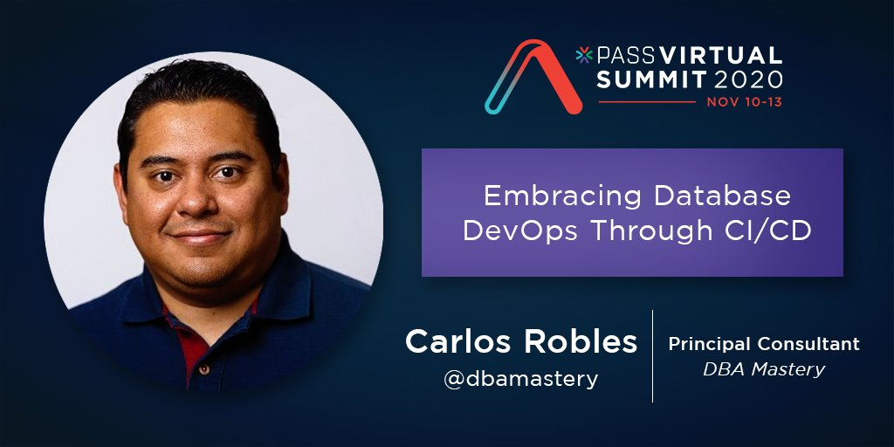

# PASS Summit 2020
## [Embracing Database DevOps through CI/CD](https://www.pass.org/summit/2020/Learn/Session-Details/sid/104708)

Evolutionary Database Design is the best phrase it can describe database migrations. But what do we know about database migrations using SQL Server containers?

This session will provide you with answers and guidelines to get you started, to embrace the Database DevOps practice for your organization. You will learn the aspects, methods, and strategies to build and manage your database deployments through CI/CD pipelines with open source tools like Flyway, Kubernetes, and cloud collaborative tools like Azure DevOps.

You will be able to build your first database migration through a CI/CD pipeline at the end of this session.

## **Prerequisites**  
* Download [Flyway comand-line](https://flywaydb.org/download/) | [container](https://hub.docker.com/r/flyway/flyway)
* Experience with SQL Server databases and software development
* Basic knowledge of Azure DevOps
* Familiarity with containers

## **Demos**  
* [Database migrations with Flyway (containers)](Demo_01)
* [Integrated pipeline - Flyway migration + App version 1.0](Demo_02)
* [Integrated pipeline - Flyway migration + App version 2.0](Demo_03)

## **Other**  
* [GeoKids - GitHub organization](https://github.com/geo-kids)  
This organization includes the following repositories:
    * *Flyway-migrations* → SQL Server database migrations files and custom Flyway image
    * *Geokids-Web-Net* → Web application .NET Core source code
    * *Geokids-App* → Integrated solution (WebApp + DB)

* [GeoKids - Azure DevOps](https://dev.azure.com/GeoKids/)  
This DevOps organization includes the main pipeline used in Demos 03 and 04.

## Note
Special thanks to [Geovani de Leon](https://www.linkedin.com/in/geovani-de-león-5a315359/) from Guatemala 🇬🇹 for the help, developing the .NET Core app for this demo. 👍 🚀

Please take a moment to check [Geovani GitHub's repository](https://github.com/yovafree). He is a very talented developer, promoting OpenSource & Microsoft technologies, and leading the new generating of software developers of Guatemala.

## Questions?
If you have questions or comments about this demo, don't hesitate to contact me at <crobles@dbamastery.com>

## Follow me
   
